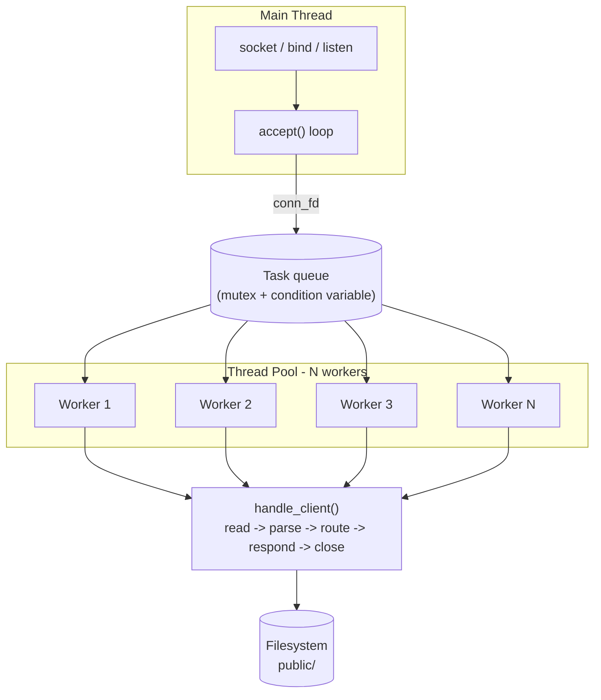

# c-multithreaded-http-server

A multithreaded HTTP/1.1 server written in C17, built from raw POSIX sockets
up through a producer-consumer thread pool. Built incrementally, milestone by
milestone, as a systems-programming learning project — every design decision
below was made (and re-made, when reviewed and found wanting) deliberately,
not generated wholesale.

## Features

- Raw POSIX socket server (`socket`/`bind`/`listen`/`accept`) — no networking
  libraries.
- Bounded HTTP request-line parsing (method/path/version), resistant to
  buffer overflow from oversized input.
- Static file serving from disk with path-traversal protection.
- Correct HTTP status codes: `200`, `400`, `403`, `404`, `500`, driven by
  `errno` inspection rather than one-size-fits-all error handling.
- Structured, leveled, timestamped logging (`INFO`/`WARN`/`ERROR`).
- A fixed-size **thread pool** (producer-consumer, mutex + condition
  variable) instead of unbounded thread-per-connection — see
  [Architecture](#architecture) for why.
- Graceful shutdown on `SIGINT`/`SIGTERM`: stops accepting, drains in-flight
  requests, joins every worker thread, frees all resources.
- Unit tests for the pure-logic parsing module; verified leak-free under
  Valgrind; debugged live with gdb.

## Architecture



**Why a thread pool instead of thread-per-connection?** An earlier version of
this server (see commit history, M7) spawned a brand-new OS thread for every
accepted connection. That works, but each thread costs a kernel scheduling
entry and a multi-megabyte stack — under connection-flood load (or just
heavy legitimate traffic), unbounded thread creation is how a server runs
itself out of memory or hits `ulimit`s, independent of how much real work is
being done. The thread pool (M8) bounds resource usage to a fixed number of
worker threads created once at startup: the accept loop becomes a
**producer** pushing connections onto a shared queue, and idle workers are
**consumers** pulling from it, coordinated by a mutex (protecting the queue)
and a condition variable (letting idle workers sleep instead of busy-polling).
The tradeoff, made concrete during development: under load exceeding the
pool size, requests queue and wait rather than the server accepting
unbounded concurrent work.

## Project structure

```
include/
  log.h             leveled/timestamped logging interface
  http.h            pure HTTP request-line parsing + path-safety checks
  request_handler.h per-connection request handling interface
  thread_pool.h      thread pool interface (create/submit/destroy)
src/
  server.c          socket setup, accept loop, signal handling, main()
  log.c             log_msg() implementation (variadic, thread-safe timestamps)
  http.c            request-line parser + path-traversal check (unit-tested)
  request_handler.c handle_client(): read, parse, route, respond, close
  thread_pool.c      worker threads, task queue, producer-consumer logic
tests/
  test_http.c       unit tests for src/http.c (no external framework)
public/
  index.html        static file served at "/"
.github/workflows/
  ci.yml            build + test on every push/PR
Dockerfile           containerized build/run
Makefile
```

## Building & running

Requires `gcc` with C17 support and pthreads (present on any standard Linux
dev setup).

```sh
make            # build ./server
make run         # build and run (listens on :8080)
make test        # build and run the unit tests
make asan        # build with AddressSanitizer + UBSan for local bug-hunting
make clean
```

```sh
./server &
curl http://localhost:8080/
curl -i http://localhost:8080/does-not-exist   # -> 404
kill -INT %1                                    # graceful shutdown
```

The listen port (`8080`) and worker count (`4`, `NUM_WORKER_THREADS` in
`src/server.c`) are currently compile-time constants — see
[Future improvements](#future-improvements).

## Testing & debugging

**Unit tests** (`make test`) cover the pure parsing logic in `src/http.c` —
valid/malformed request lines and safe/traversal paths — without needing a
live socket.

**Valgrind**, run against a live session (real requests, a 404, a rejected
path-traversal attempt, then a graceful `SIGINT` shutdown):

```
==31938== HEAP SUMMARY:
==31938==     in use at exit: 0 bytes in 0 blocks
==31938==   total heap usage: 14 allocs, 14 frees, 5,916 bytes allocated
==31938== All heap blocks were freed -- no leaks are possible
==31938== ERROR SUMMARY: 0 errors from 0 contexts (suppressed: 0 from 0)
```

**gdb**, breaking on `thread_pool_create` to inspect pool startup:

```
Breakpoint 1, thread_pool_create (num_threads=4) at src/thread_pool.c:57
$1 = 4
[New Thread 0x7ffff7bff6c0 (LWP 8514)]
[New Thread 0x7ffff73fe6c0 (LWP 8515)]
[New Thread 0x7ffff6bfd6c0 (LWP 8516)]
[New Thread 0x7ffff63fc6c0 (LWP 8517)]
0x... in main () at src/server.c:66
Value returned is $2 = (thread_pool_t *) 0x55555555b4c0
```

(Note: attaching gdb to an *already-running* process requires relaxed Yama
ptrace restrictions; running the server directly under gdb, as above via
`break` + `run`, works in any environment since gdb is the process's direct
parent.)

## Performance considerations

- **Fixed thread pool size** (`NUM_WORKER_THREADS = 4`): bounds memory/CPU
  regardless of connection volume, at the cost of queuing once concurrent
  in-flight requests exceed the pool size. A reasonable production starting
  point is roughly the number of CPU cores for CPU-bound work, or higher for
  I/O-bound workloads (this server's request handling is mostly blocking
  file I/O, so a larger pool than core-count is defensible).
- **Blocking syscalls throughout** (`accept`, `read`, `write`): simple to
  reason about, but means one worker thread is fully occupied per in-flight
  connection, even while it's blocked waiting on disk I/O. An `epoll`-based
  event loop would decouple "connections in flight" from "threads in use,"
  at significant implementation complexity cost.
- **No `Content-Length` streaming for huge files**: the whole response
  header is built with `snprintf` into a stack buffer before any body bytes
  are sent, but the *body* is streamed in 4KB chunks rather than loaded
  into memory at once — so large file serving doesn't blow up per-request
  memory, but each chunk is still a separate `write()` syscall (no
  `sendfile()`).
- **No connection keep-alive**: every request closes its connection
  (`Connection: close` implied by not supporting keep-alive), meaning every
  single request pays a full TCP handshake — measurable overhead for
  workloads with repeat clients.

## Future improvements

- **`epoll`/event-driven I/O** to decouple concurrent connections from
  thread count entirely (the natural "next tier" after a thread pool).
- **HTTP keep-alive** support (`Connection: keep-alive`, serving multiple
  requests per TCP connection).
- **Configurable port/thread-pool size** via CLI args or a config file
  instead of compile-time constants.
- **Chunked transfer encoding** for responses where the size isn't known
  upfront.
- **MIME type detection** by file extension instead of hardcoding
  `text/html`.
- **Request timeouts** (currently a slow/stalled client can occupy a worker
  thread indefinitely).
- **TLS support** (would likely mean integrating OpenSSL/BoringSSL rather
  than hand-rolling crypto).

## License

MIT
